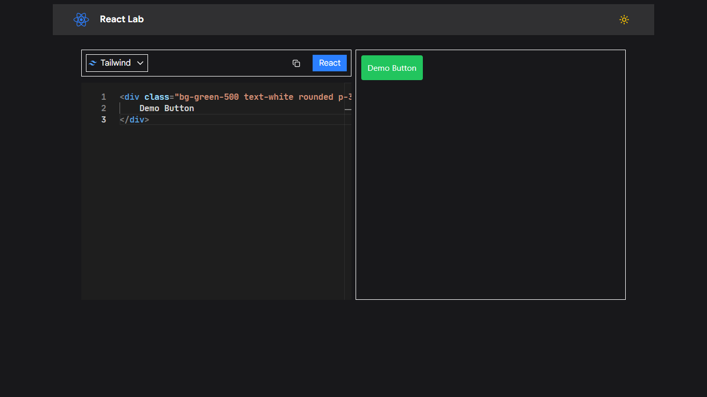
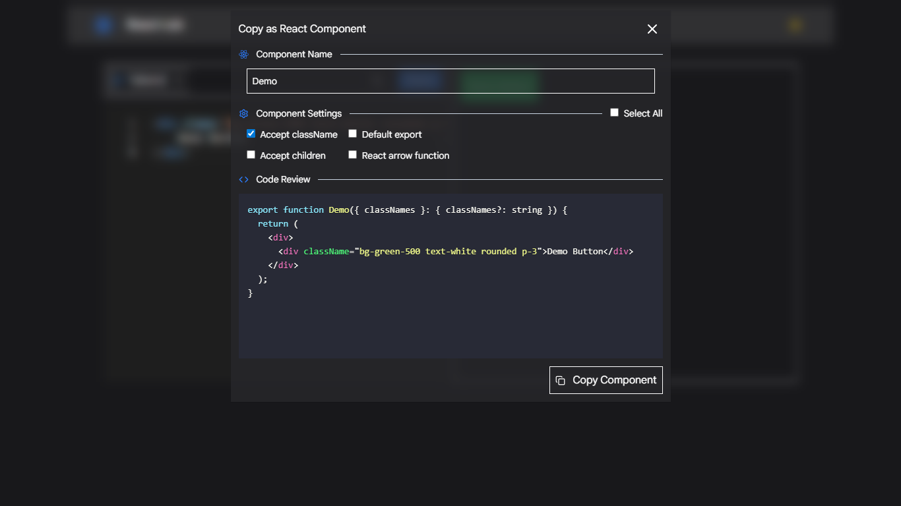

# React Lab


React Lab is a web app for writing, previewing, and copying React components quickly.
Built with React, TypeScript, and Tailwind CSS.

## Previews

**React Lab Editor**



**React Component Copier**



## Tech Stacks
- Vite
- React
- Typescript
- Tailwind CSS
- Monaco Editor

## Features
- Write HTML with Emmet support.
- Switch between Bootstrap or Tailwind CSS instantly.
- Drag preview component freely inside the preview frame.
- Copy clean HTML.
- Generate and Copy React Component.
  - Function Component.
  - Arrow Function Component.

## Getting Started

### Prerequisites
- Node.js 24+

### Installation
```bash
git clone https://github.com/yewontaung/react-lab.git
cd react-lab
npm install
npm run dev
```

## License
MIT License